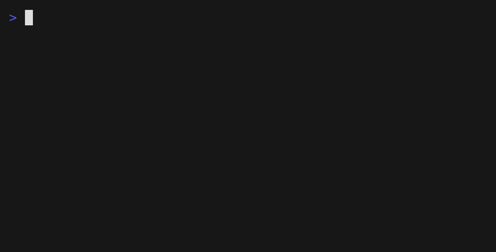

# hosts-blocker

[](https://www.python.org/downloads/)
[](https://github.com/astral-sh/ruff)
[](https://github.com/menzhik/hosts-blocker/actions/workflows/ci.yml)

Block distracting websites using the system hosts file.
Harder to bypass than browser extensions, as it works at the OS level.



## Installation

```sh
uv tool install git+https://github.com/menzhik/hosts-blocker
```

> [!NOTE]
> This tool needs root privileges:
> `sudo $(which hosts-blocker)`

Without `uv`, install the package into an existing Python environment with `python -m pip install .` from a local checkout.

## Usage

```text
$ sudo $(which hosts-blocker)
Number of pages: 1
Enter URL: reddit.com
Blocked 2 hostname(s)
```

Re-running replaces the previous block list instead of appending duplicates.

## How it works

The tool adds entries to your system's hosts file:

```
# hosts-blocker BEGIN
0.0.0.0        reddit.com
::1            reddit.com
0.0.0.0        www.reddit.com
::1            www.reddit.com
# hosts-blocker END
```

## Development

```sh
git clone https://github.com/menzhik/hosts-blocker.git
cd hosts-blocker
uv sync --all-groups
uv run ruff check .
uv run ruff format --check .
uv run mypy
uv run pytest
```

## License

MIT License, see [LICENSE](LICENSE)
